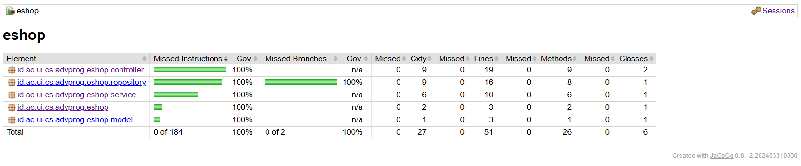

Nama: Valentino Kim Fernando
NPM: 2306275771

    
<h2>Module 1</h2>

# Reflection 1
## Prinsip-prinsip Clean Code dan Secure Coding yang diterapkan
Pada projek kali ini, saya telah menerapkan beberapa coding standards Java di antaranya:
- Nama variable yang bermakna
  Nama variabel, metode dan kelas menggunakan nama yang deskriptif dan intuitif untuk pembaca.
  Misalnya, `Product`, `ProductService, `ProductController` yang menggambarkan dengan jelas peran mereka dalam app.

- Membuat function sependek mungkin
  Membuat fungsi yang hanya memiliki satu tujuan saja. Contohnya create, edit, delete dan lain nya yang hanya didedikasikan
  untuk memiliki satu tujuan saja.

- Menghindari Rendundansi
  `ProductRepository` dengan baik menggunakan metode helper (misalnya `findById`) untuk menghindari kode yang redundant.
  Metode edit memanfaatkan `findById` untuk menghindari duplikasi logic pencarian produk.

- Konsisten dalam formating dan indentasi
  Hal ini dilakukan supaya coder maupun pembaca bisa dengan nyaman membaca code.

## Hal yang dapat dikembangkan
- Validasi Data
  Validasi tentunya penting dalam keamanan sebuah app, tentunya ini akan menambahkan kinerja app ke arah yang lebih positif.

- Penanganan Error dan Feedback ke Pengguna:
  Saat ini, tidak ada penanganan jikalau produk tidak ditemukan (misalnya, saat mencoba mengedit atau menghapus produk yang tidak ada).
  Menambahkan penanganan error dan feedback kepada pengguna akan meningkatkan user experience dan ketahanan aplikasi.
  Sebagai contoh, Anda bisa menampilkan pesan kesalahan atau mengarahkan pengguna ke halaman "produk tidak ditemukan".

# Reflection 2
# Nomor 1
- Setelah saya membuat unit testing, saya menjadi lebih terbuka dengan debugging menggunakan testing, coder tidak harus melaksanakan alur yang panjang untuk mengetahui hasil dari suatu test.
- Seharusnya semakin banyak test yang dibuat, maka semakin baik sebuah app terjaga secara fungsional.
- Dibagi menjadi beberapa kasus-kasus tertentu yang memiliki outcome berbeda, semakin banyak kasus yang di-cover oleh unit test maka semakin baguslah kode tersebut.
- Menurut saya, kode yang memiliki 100% code coverage belum tentu terjamin tidak memiliki bug. Ini lebih memberikan gambaran sejauh mana kode itu diuji. Misal unit testing belum men-cover suatu bug tertentu, maka bisa saja code coverage-nya 100%.

# Nomor 2
- Seharusnya kode nya akan serupa dari segi setup procedures dan instance variables. Hal ini dapat mengurangi kualitas kode karena akan terjadi duplikat, yang tentunya tidak sesuai dengan kaidah clean code yang telah diajarkan pada modul kali ini. Untuk mengembangkan kasus ini, kita bisa membuat setup pada fungsi atau kelas tertentu sehingga bisa dipakai berulang kali tanpa membuat kode mengalami duplikasi.

    
<h2>Module 2</h2>

# Reflection 1

## Link Deployment
http://different-phelia-soydoradesu-d15f7223.koyeb.app/

## Code quality issue yang telah diperbaiki
- Menghapus modifier public pada interface ProductService
  Sebelumnya, interface ProductService menggunakan modifier public, padahal modifier tersebut tidak diperlukan. Secara default, metode dalam interface bersifat public. Penghapusan modifier ini bertujuan untuk mengurangi redundansi. Setelah menyadari hal ini, saya langsung menghapus modifier public pada interface ProductService.

- Menghapus unused import
  Sebelumnya, terdapat penggunaan import all (import *) yang menyebabkan adanya unused import, karena tidak semua yang diimpor digunakan. Setelah mengetahui hal ini, saya mengganti import bintang dengan import secara spesifik untuk setiap kelas yang diperlukan.

## Apakah implementasi sekarang telah sesuai dengan definisi Continuous Integration and Continuous Deployment (CI/CD)?
Alur kerja yang diterapkan saat ini sudah memenuhi definisi dari CI/CD, karena mencakup tahapan-tahapan penting seperti pengolahan kode, pengujian otomatis, review, dan deployment. Github Workflow memegang peranan penting dalam proses ini, yang terdiri dari beberapa bagian berikut:

- `ci.yml` yang menjalankan unit test setiap kali terjadi push atau pull request, sehingga kita dapat memastikan bahwa perubahan kode tidak merusak fungsionalitas yang sudah ada sebelumnya.
- `pmd.yml` yang melakukan review terhadap kode untuk meminimalkan kesalahan dan menjaga kualitas kode secara keseluruhan.
- `scorecard.yml` yang melakukan analisis untuk memastikan keamanan kode tetap terjaga.

Setelah melalui tahapan-tahapan tersebut, perubahan kode akan di-merge ke branch utama seperti main, kemudian secara otomatis akan di-build oleh Koyeb hingga website dapat berjalan dengan lancar. Dengan demikian, seluruh proses CI/CD telah diimplementasikan dengan baik.

## Code Report

    
<h2>Module 3</h2>

# Reflection 1

## Prinsip SOLID apa yang saya sudah implementasikan?
- Single Responsibility Principle (SRP):
  Saya memisahkan `CarController` dari `ProductController` karena keduanya memiliki tanggung jawab yang berbeda. Dengan memisahkannya dan menghilangkan extends ke ProductController`, setiap kelas kini hanya memiliki satu alasan untuk berubah, sesuai dengan prinsip SRP.

- Open/Closed Principle (OCP):
  Struktur controller yang saya buat memungkinkan penambahan endpoint baru tanpa perlu mengubah fungsionalitas yang sudah ada. Dengan demikian, sistem tetap fleksibel untuk development lebih lanjut tanpa memodifikasi kode yang telah berjalan dengan baik.

- Interface Segregation Principle (ISP):
  Saya memastikan bahwa service hanya menyediakan metode yang benar-benar dibutuhkan oleh controller, sehingga tidak ada metode yang berlebihan atau tidak terpakai. Hal ini menjaga agar codebase lebih modular dan maintainable.

- Dependency Inversion Principle (DIP):
  Sebelumnya, `CarController` memiliki Bean bernama carService yang bergantung langsung pada kelas konkret. Sesuai dengan prinsip DIP, ketergantungan seharusnya diarahkan ke abstraksi (interface) daripada implementasi konkret. Oleh karena itu, saya mengubah carService agar bergantung pada interface `CarService`, bukan langsung ke implementasi konkretnya.

## Manfaat menggunakan SOLID
Menerapkan prinsip SOLID dalam project development membawa banyak keuntungan, di antaranya membuat kode lebih bersih(readable), modular, dan mudah untuk di-develop seiring waktu.

- Kode lebih mudah dipahami
  Dengan menerapkan Single Responsibility Principle (SRP), setiap class memiliki satu tanggung jawab yang jelas. Misalnya, jika kita memiliki CarController yang hanya mengurus logic terkait mobil, orang lain yang membaca kode kita dapat langsung memahami fungsinya tanpa kebingungan dengan logika produk lain.

- Mudah untuk di-develop
  Dengan mengikuti Open/Closed Principle (OCP), kita bisa menambahkan fitur baru tanpa memodifikasi kode yang sudah ada. Misalnya, jika kita ingin menambahkan `MonsterTruckController`, kita cukup membuat kelas baru tanpa perlu mengutak-atik `CarController`, sehingga mengurangi risiko bug pada fitur yang sudah berjalan.

## Disadvantage apabila tidak menggunakan SOLID
Berlawanan pada jawaban di atas, apabila kita tidak menggunakan SOLID, kode akan sulit dibaca, dipahami, dan dikelola.

- Kode sulit dipahami dan dikelola
  Tanpa Single Responsibility Principle (SRP), satu class bisa memiliki banyak tanggung jawab yang tidak relevan, membuat kode menjadi berantakan. Misalnya, jika `CarController` tidak hanya menangani logic mobil tetapi juga mengelola payment logic, kode akan menjadi membingungkan dan sulit untuk dimodifikasi tanpa merusak bagian lain.

- Modifikasi dapat merusak bagian lain
  Jika Open/Closed Principle (OCP) tidak diterapkan, setiap kali kita ingin menambahkan fitur baru, kita harus mengubah kode lama. Misalnya, jika kita ingin menambahkan `MonsterTruckController` dan harus mengedit `CarController` untuk menyesuaikan, kita bisa secara tidak sengaja menambahkan bug pada fitur yang sudah ada dan bekerja dengan baik.

    
<h2>Module 4</h2>

# Reflection 1

## 1. TDD Useful atau tidak?
Menurut saya, TTD useful karena memiliki lumayan banyak manfaat, di antaranya:
- Mencegah over-engineering, karena saya hanya akan menulis code yang diperlukan dalam test
- Mempermudah refactoring, karena jika saya ingin meng-improve code, saya lebih percaya diri karena ada test yanng bisa memastikan bahwa modifikasi tidak merusak fungsionalitas yang ada
- Meningkatkan kualitas kode, karena saya tentunya lebih yakin bahwa kode saya sudah terhindar dari bug apabila lulus testing

## 2. Apakah sudah cukup mengikuti prinsip F.I.R.S.T?
Unit test yang saya buat sudah cukup mengikuti prinsip F.I.R.S.T., namun masih ada beberapa aspek yang perlu ditingkatkan. Misalnya, beberapa test masih kurang independen karena ada ketergantungan antar-test yang bisa mempengaruhi hasil. Ke depannya, saya harus memastikan setiap test benar-benar independen dan dapat dijalankan secara terpisah. Selain itu, saya juga perlu memperhatikan scope testing agar lebih banyak edge cases yang diuji, serta memastikan setiap test memiliki fokus yang jelas untuk satu fungsi tertentu saja. Hal ini akan meningkatkan efektivitas dan kualitas dari unit test yang saya buat.

